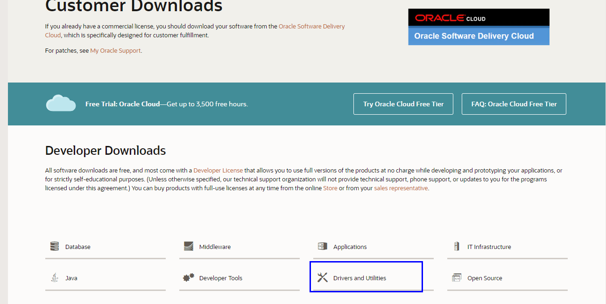
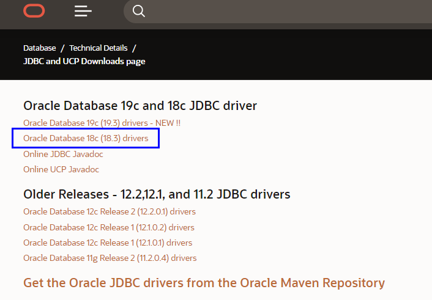
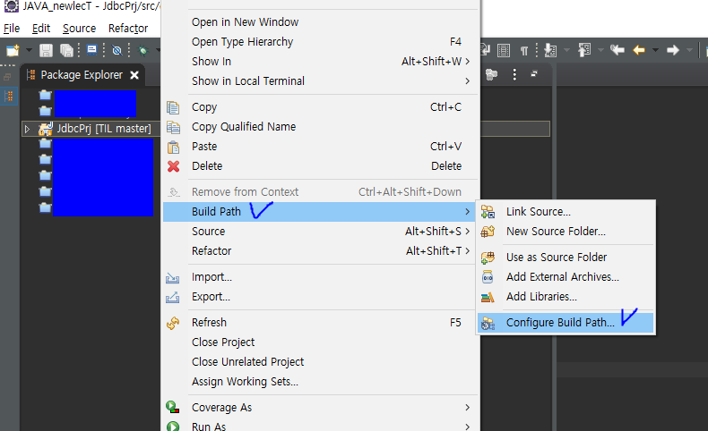

# [Oracle, JDBC] 오라클 데이터베이스,자바 jdbc 드라이버 파일 연결하기(ojdbc.jar) 

**JDBC**(Java Database Connectivity)는 자바에서 데이터베이스에 접속할 수 있도록 하는 자바 API


설치한 오라클 데이터베이스 버전:  Database 18c Express Edition


## ★오류 상황


```java
   1: public class Program {
   2: 
   3:     public static void main(String[] args) throws SQLException {
   4:         Scanner scanner=new Scanner(System.in);
   5:         String id=scanner.nextLine(); 
   6:         
       		 // 오라클 데이터베이스 서버의 URL
   7:         String url="jdbc:oracle:thin:@localhost:1521/xepdb1";
   8:         String sql="SELECT * FROM MEMBER WHERE ID='"+id+"'"; //실행시킬 쿼리문
   9: 
  10:         Connection connection=DriverManager.getConnection(url,"lec","111");
  11:         Statement statement=connection.createStatement(); 
  12:         ResultSet resultSet=statement.executeQuery(sql); 
  13:         
  14:         
  15:         String idString="";
  16:         String nameString="";
  17:         String genderString="";
  18:         String pwdString="";
  19: 
  20:         while(resultSet.next()){
  21:         idString=resultSet.getString("ID");
  22:         pwdString=resultSet.getString("PWD");
  23:         nameString=resultSet.getString("NAME");
  24:         genderString=resultSet.getString("GENDER");
  25:             System.out.printf("%d->ID:%s PWD:%s NAME: %s GENDER:%s\n",i,idString,pwdString,nameString,genderString);
  26:         }
  27:     
  28:     }
  29: 
  30: }
```

>  오라클 데이터베이스에 자바를 연결시키기 위해서 위 소스를 실행시켰더니 아래와 같은 예외가 발생했다.

Exception in thread "main" java.sql.SQLException: No suitable driver found for jdbc:oracle:thin:@192.168.0.19:1521/xepdb1
	at java.sql/java.sql.DriverManager.getConnection(DriverManager.java:702)
	at java.sql/java.sql.DriverManager.getConnection(DriverManager.java:228)


##  ▶알아낸 오류 원인 

오라클 데이터베이스와 java를 연결시킬 jdbc 드라이버가 필요함

## ♥해결 방법

1) 오라클 공식홈페이지 접속 -> 화살표한 메뉴바 클릭

https://www.oracle.com/index.html 


2) Downloads 클릭


3) Drivers and Utilities 메뉴에서 JDBC Drivers 클릭




4) 저자가 설치했던 Database 버전은 [Database 18c Express Edition] 이므로 아래 표시한 18c drivers를 다운! 



5) 아래 표시한 ojdbc8.jar 파일 다운! 


6) 나의 프로젝트 오른쪽 클릭 -> Build Path -> Configure Build Path 클릭



7) Add External JARs 클릭


8) 설치한 ojdbc8.jar 선택 후 열기 -> Apply -> Apply and close


위 과정을 통해 예외에 대한 오류가 해결되고,  오라클 데이터베이스에 자바로 jdbc 드라이버 파일 연결에 성공한다.

