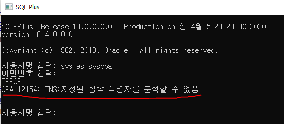
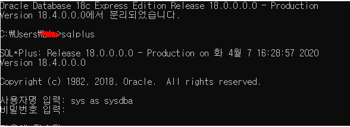
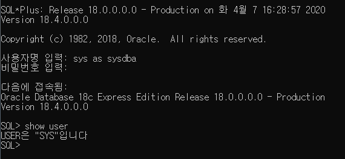
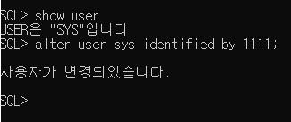

**★ 에러 발생 상황**

명령프롬프트(CMD)창에서 sqlplus 입력해서 접속하여

사용자명 입력: sys as sysdba

비밀번호 입력:

초기 데이터베이스 설치시 기호까지 포함해서 설정한 비밀번호를 입력하였는데

아래와 같은 에러가 나타남

ORA-12154: TNS: 지정된 접속 별자를 분석할 수 없는 에러 발생

**♥ 에러 해결**

비밀번호를 간단한 숫자로 변경 후 접속 했더니 잘 접속되었다.

\+ sys/system 관리자 계정 비밀번호 변경방법 ↓

1) 비밀번호 입력 없이 Enter

2) **show user** 입력하면 현재 접속 계정 이름을 확인할 수 있다.

3) **alter user sys identified by 1111;** --> sys의 계정 비밀번호를 1111로 변경

4) **conn sys/1111 as sysdba;** --> 위에서 변경한 비밀번호 1111로 sys 계정 접속

끝!

♥수정이 필요한 부분 , 지적해주실 부분은 댓글로 부탁드려요~ 피드백은 언제나 환영입니다♥

♥긴 글 읽어주셔서 감사합니다♥