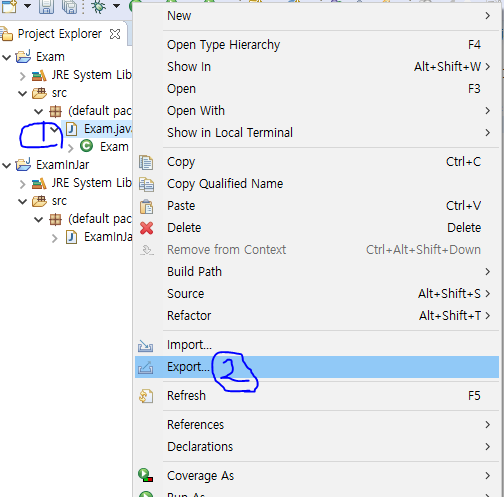
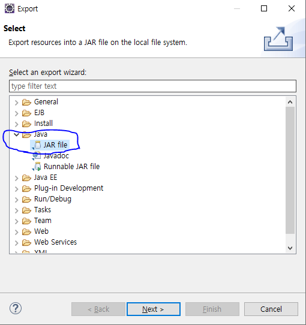
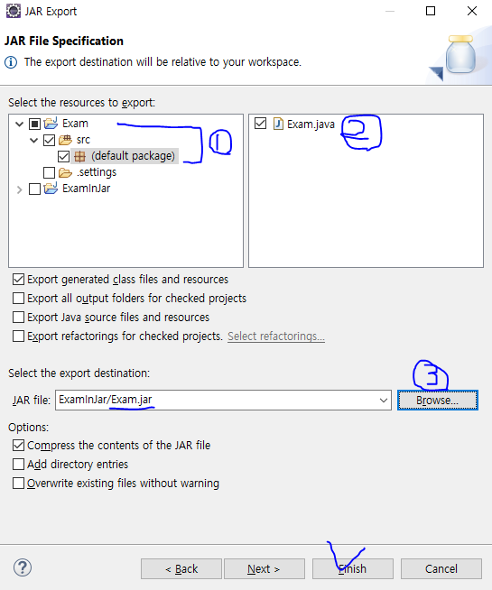
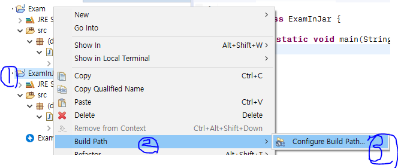
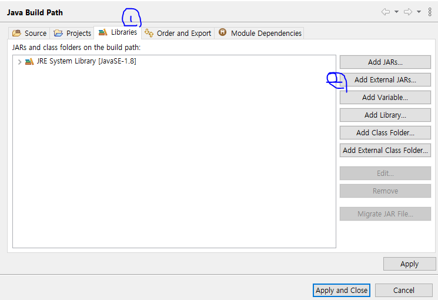
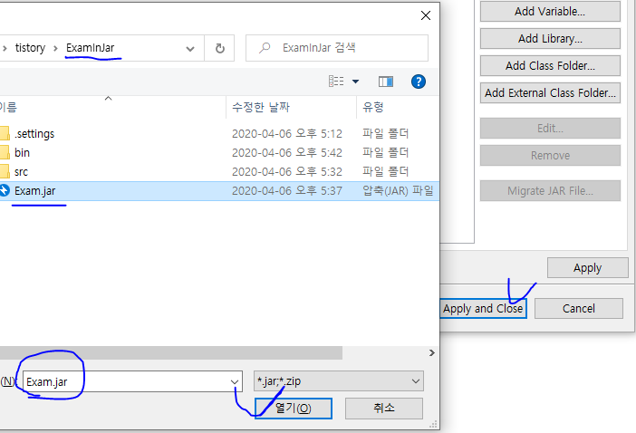
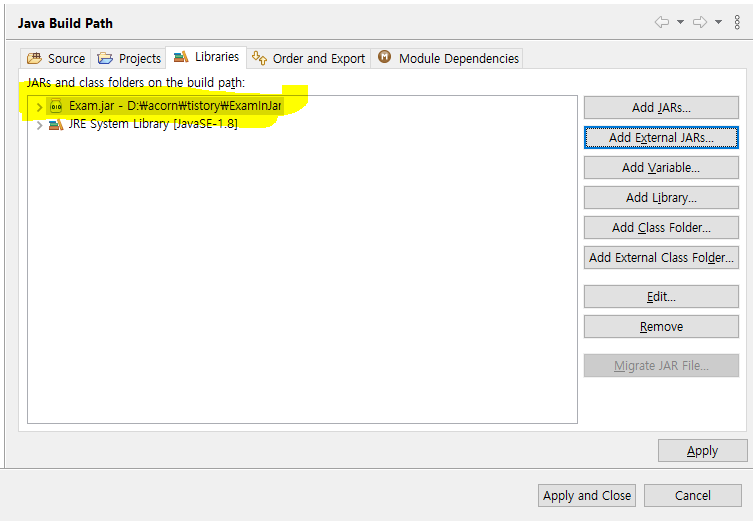
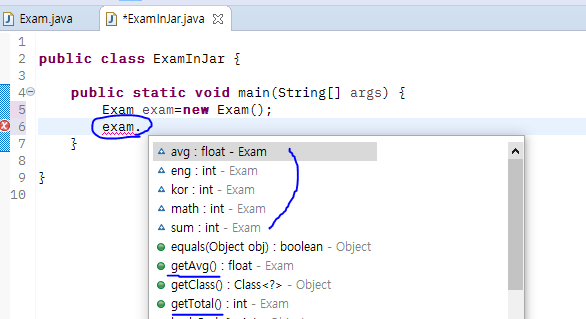

# [Eclipse,Java] 클래스파일을 JAR(파일 포맷)로 만들어서 다른 프로젝트 클래스에서 라이브러리로 사용하기 


★이클립스에서 내가 프로젝트 내에 있는 **특정 클래스를 다른 프로젝트의 클래스에서 라이브러리처럼** 사용하고 싶을 때 Jar파일로 압축하여 사용할 수 있다.


우선, 위키백과에 나와있는 Jar라는 용어설명부터 보겠다.

```
JAR(Java Archive, 자바 아카이브)는 여러개의 자바 클래스 파일과, 클래스들이 이용하는 관련 리소스(텍스트, 그림 등) 및 메타데이터를 하나의 파일로 모아서 자바 플랫폼에 응용 소프트웨어나 라이브러리를 배포하기 위한 소프트웨어 패키지 파일 포맷이다.

JAR 파일은 실제로 ZIP 파일 포맷으로 이루어진 압축 파일로서, 파일 확장자는 .jar이다. 컴퓨터 사용자들은 JDK에 포함된 jar 명령어를 이용하여 JAR 파일을 만들거나 압축을 풀 수 있다. 
```

> 출처 : [위키백과 JAR(파일포맷)](https://ko.wikipedia.org/wiki/JAR_(파일_포맷))


긴 말 필요없이, 실습방법을 통해 알아보겠다.

☞ **목적** : **Exam 클래스**를 다른 프로젝트에 있는 **ExamInJar 클래스 안에서 라이브러리처럼** 사용하고 싶은 것


### Exam 프로젝트에서 Exam 클래스를 Jar파일로 만들기

**1)**

① Exam 클래스 오른쪽 마우스 클릭 

② Export 클릭




**2)**  Java -> JAR file 클릭 후 Next




**3)** 

①내가 Jar파일로 만들 프로젝트 -> src -> 패키지가 있다면 패키지 선택 

②클래스 선택

③ Browse 클릭 후 Jar파일 명을 입력 후 jar파일을 사용할 프로젝트 폴더(ExmaInJar)에 저장해도 되고, 아니면 그냥 해당 Exam 프로젝트 폴더에 저장해도 된다.  -> Finish




### ExamInJar 프로젝트에 위에서 만들었던 jar파일 사용하기

**1)** 

①ExamInJar 프로젝트 오른쪽 클릭

②Build Path 클릭

③Configure Build Path 클릭




**2)**

①Libraries 클릭

②Add External JARs... 클릭





**3)** 위에서 저장했던 Exam.jar 파일을 열기 클릭



**4)** Libraries 탭에 Exam.jar 파일이 추가된 것을 확인할 수 있다. -> Apply and Close



**5)** Exam 클래스안에 있는 필드와 메소드를 ExamInJar 클래스에서 Exam 객체를 만들어서 Exam클래스의 필드와 메소드를 사용할 수 있는 것을 확인할 수 있다.


> Exam 클래스



> ExamInJar 클래스


