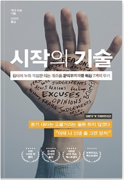

# [독서진행중]시작의 기술(침대에 누워 걱정만 하는 게으른 완벽주의자를 위한 7가지 무기) - 개리 비숍 - 1일차

**책 분류** : 자기계발 - 처세술/삶의자세

**독서 시작** : 20.03.26`~`

**독서 일자**: 20.03.26

☞**책 선택 이유**

1\. 같은 학원에 다니는 형님이 서점에서 잠깐 읽어봤는데 유익하고, 구입하고 싶은 책중에 하나라고해서 

구입하게 되었다.

2\. 표지가 일단 이쁘고, 들고 다니기에 크기도 안성맞춤이다.

3\. "침대에 누워 걱정만 하는" 의 부제에서 확 마음이 끌렸다!

☞ **언제, 어디서 / 얼마나 / 몇 페이지**

학원(Acorn)에 가는 오전시간,  버스와 지하철 / 약 10분 / p.1~23

_p.23_

>로마 황제가 된 스토아학파 철학자 마르쿠스 아우렐리우스는 이렇게 말했다.
"앞으로 이 규칙을 기억하라. 혹시라도 억울한 기분이 들려고 하면 '나는 불운해' 라고 생각하지 말고,
<u>'이걸 잘 이겨내면 행운이 올 거야'</u>라고 생각해라."

\--> 내가 기존에 생각하고 있던 사고의 전환이 중요한 거 같다. 부정적인 일이 나에게 생길 때 긍정적인 말로 내 자신을 다독이면서 긍정적인 사고를 가질 수 있도록 노력해야겠다.

